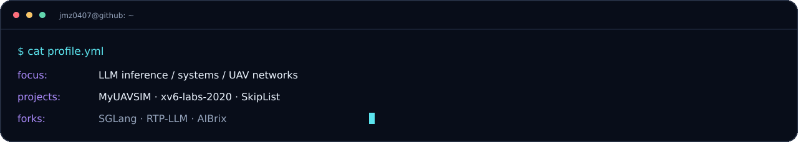
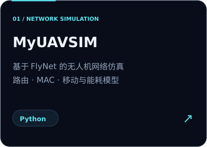
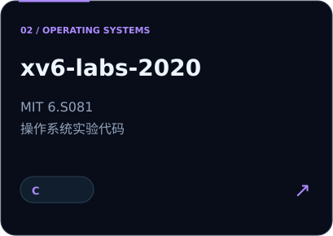
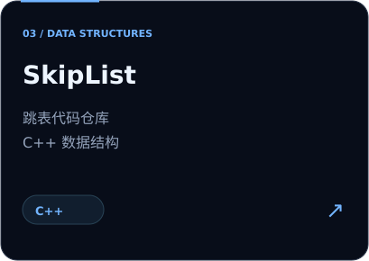

### SELECTED PROJECTS

<table><tr>
<td width="33%"></td>
<td width="33%"></td>
<td width="33%"></td>
</tr></table>

### INFERENCE ECOSYSTEM

[SGLang](https://github.com/jmz0407/sglang) · [RTP-LLM](https://github.com/jmz0407/rtp-llm) · [AIBrix](https://github.com/jmz0407/aibrix)
